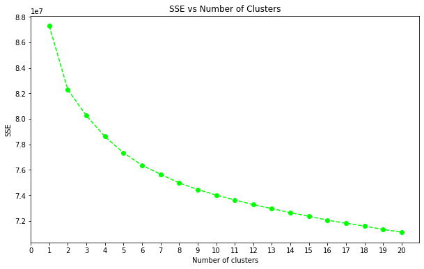
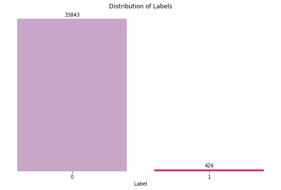

# Udacity-DS-Nanodgree_Project6 : Bertelsmann/Arvato Project

Bertelsmann Arvato is a global services company headquartered in Gütersloh, Germany. The dataset for this project was provided by Arvato and this project is made up of two major parts:

Customer Segmentation (Unsupervised Learning:

The first of which is a Customer Segmentation problem where the end point is focused on how to acquire new Arvato clients more efficiently. To do this, we were provided with two datasets: 
- Udacity_AZDIAS_052018.csv: Demographics data for the general population of Germany; 891 211 persons (rows) x 366 features (columns).
- Udacity_CUSTOMERS_052018.csv: Demographics data for customers of a mail-order company; 191 652 persons (rows) x 369 features (columns).

Using unsupervised learning techniques, perform customer segmentation and identify parts of the general population that best describes the core customer base for Arvato. 
This was achieved by creating clusters of Arvato’s existing customers super-imposed against clusters of the general population to identify both underrepresented and overrepresented clusters

Supervised Learning:

This part of the project focuses on predicting individuals most likely to become future customers of Arvato. The datasets for this project are:
- Udacity_MAILOUT_052018_TRAIN.csv: Demographics data for individuals who were targets of a marketing campaign; 42 982 persons (rows) x 367 (columns).
- Udacity_MAILOUT_052018_TEST.csv: Demographics data for individuals who were targets of a marketing campaign; 42 833 persons (rows) x 366 (columns).

Using supervised learning techniques, predict future customers of Arvato. These are individuals that would respond positively (i.e., a “1” in the “RESPONSE” column) to the marketing campaign

## Libraries

The following libraries were used:
- python
- pandas
- pickle
- sklearn
- matplotlib
- seaborn
- random
- warnings
- xgboost

## Files in the repository

- data (saved csv files, the input dataset is not publicly available, hence not saved here)
    - kaggle_predictions.csv : kaggle prediction with XGBClassifier
    - kaggle_predictions2.csv : kaggle prediction with XGBRegressor
    - overrepresented1.csv : Cluster 1 which is an overrepresented cluster in the Customer dataset
    - underrepresented2.csv : Cluster 2 which is an underrepresented cluster in the Customer dataset

- Plots (plots saved from Jupyter notebook)
    - ADB.png
    - age_dist.png
    - cummulative_explained_variance.png
    - dimension_1.png
    - dimension_2.png
    - dimension_3.png
    - gender_dist.png
    - general_customer_cluster.png
    - household-status_dist.png
    - label_imbalance.png
    - LR.png
    - post-encoding_columns_na.png
    - post-encoding_rows_na.png
    - pre-encoding_columns_na.png
    - RF.png
    - rows_with_na_drop_justification.png
    - scree_pca.png
    - SSE_vs_cluster.png
    - XGB.png

- Arvato_project_report.pdf (detailed project write-up)

- Customer_Segmentation_1.ipynb (jupyter notebook for cleaning data)

- Customer_Segmentation_2.ipynb (jupyter notebook for unsupervised learning)

- Customer_Segmentation_3.ipynb (jupyter notebook for supervised learning)

## Project Summary

This project was made up of two parts:
### Unsupervised Learning:
Before applying my clustering technique (Kmeans), I decided to reduce the dimensions of my dataset to avoid the curse of dimensionality. I used PCA to achieve this. 
I first ran PCA on all the features I had (389), and then made a plot of cumulative explained variance against number of components. The aim was to achieve at least 90% variance, and this was achieved with 200 components as opposed to the initial 389 components I started with

I re-ran my PCA with just 200 columns as determined above and KMeans was applied to the resulting dataset.
To determine my optimal “k”, I used the elbow method on the plot I got from running KMeans for varying number of clusters between 1 and 20 inclusive 

### Supervised Learning
Here, I decided to experiment with 4 learners: Linear Regression, Adaboost, Random Forest and XGBoost. I used base settings for all classifiers and “ROC_AUC” was my preferred metric.
As a result of the unbalanced set of my dataset, I decided to use StratifiedKFold to split my data, and I used 5 folds

My best performer was XGBoost with base settings and my score was 0.78. 

I decided to refine my XGBoost learner some more to get better performances. Here, I decided to use Sklearn’s GridSearchCV to find the best parameters that would improve my model. I was constrained by computation time, and so I ran GridSearchCV on limited parameters (this can be expanded on to get a better performing model). I was able to get some improvement in my score which became 0.79

I did apply this to my kaggle submission and my score was 0.67592 at position 138.
I decided to further tweak my learner and use an XGBRegressor instead of XGBClassifier with my best parameters from GridSearchCV and that improved my kaggle submission score to 0.77110 at position 106

## Metrics

For my unsupervised learning part of this project, I used the elbow method to determine my optimal number of “k” to use for my clusters.

  

For the supervised learning part of this project, I decided to use “ROC_AUC” and this was because of the highly unbalanced nature of my dataset. I cared about predicting accurately for both the majority and minority class and “ROC_AUC” fulfilled that bit.
The highly unbalanced nature of my labels is represented below by the plot:

  

## Results
My blog post can be found at https://medium.com/@osarugue.egharevba/bertelsmann-arvato-capstone-project-e8fe656ae1d5

### Unsupervised Learning
Below is my result from clustering both my General population and Customer dataset:
 
Here, I can see that cluster 1 is over-represented in my Customer dataset, while cluster 2 is under-represented in my Customer dataset.
Looking at some of the attributes of cluster 1 as compared to cluster 2, I can hazard a guess that cluster 1 are wealthy urban dwellers with families, well ingrained into the society and have great purchasing power, while cluster 2 are younger, openminded households that are less calculated in their spending, thus have higher financial interest and typically live in poor neighborhoods

Here is a table that compares some characteristics of Cluster 1 against Cluster 2:

| Underrepresented cluster – Cluster 2        | Overrepresented cluster – Cluster 1      |
| :------------- | -------------:|
| Born in the 80s      | Born in the 50s |
| Comfortable households     | Prosperous households     |
| Lower income | High income      |
| Higher financial interest	| Lower financial interest |
| Average purchasing power	| High purchasing power |
| Poor neighborhood	| Average neighborhood |
| 7 years of residence	| Length of residence more than 10 years |

### Supervised Learning
For my supervised learning, I did make use of 4 learners with base settings. Below are the roc_auc scores and time to train and test:

| Model        | Train Score         | Test Score  |
| ------------- |:-------------:| -----:|
| Logistic Regression      | 0.85 | 0.67 |
| Random Forest     | 1      |   0.62 |
| AdaBoost | 0.9      |    0.75 |
| XGBoost | 0.93      |    0.78 |

XGBoost performed the best with unseen (test) data, and Random forest had the fastest training time. I proceeded with XGBoost, and after finetuning my results using GridSearchCV, my final result on test data was 0.79 with parameters:

{“colsample_bytree”: 0.5,  “gamma”: 1.0, “learning_rate”: 0.1, “max_depth”: 2, “min_child_weight”: 8, “n_estimators”: 200,  “scale_pos_weight”: 50, “subsample”: 0.5}

StratifiedKFold with 5 folds split my data into train and crossvalidation (cv) set. It trained my model on the train set and validated on the cv (test) set using roc_auc. My final score outputted is the average score for all 5 folds
On the Kaggle competition, my XGBoost model tweaked with the parameters listed above had a score of 0.67592 at position 138.

I further decided to use an XGBRegressor with objective as “binary:logistic” and that gave me better scores on my Kaggle competition with 0.77110 at position 106

## Licensing, Authors, Acknowledgements

I would like to thank Arvato Financial Solutions for the datasets and Udacity for making this project possible.
